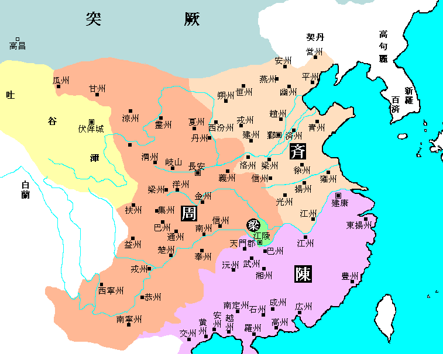

# 古来得天下之易，未有如隋文帝者

​		“古来得天下之易，未有如隋文帝者。”这句话是清代史学家赵翼说的，你可能不知道这句话，也可能对这个人没什么概念，但这个人的一句诗你肯定知道的，就是那个做出“江山代有才人出，各领风骚数百年”的赵翼。

​		说隋文帝杨坚之前，要先说一下北周。

​		北周（557年-581年）是中国历史上南北朝时期的北朝之一。又称后周（宋朝之后鲜用），因为宋之后常用来代指唐朝灭亡之后五代十国时期从951年正月后周太祖郭威灭后汉开国到960年北宋太祖赵匡胤陈桥兵变这期间的一个朝代。北周由宇文氏建立，定都长安。

​		北周自建国后，统治实权一直在霸府宇文护身上，皇帝无力与之抗阻。这个皇帝就是历史上著名的大牛人，北周武帝宇文邕（兰陵王看过吧，就是那里面的那个宇文邕），鲜卑人，17岁登基做傀儡皇帝（我17岁还在苦逼的上高中，还是在河北这种高考大省），虽然人家是傀儡，但是29岁拿板砖呼死宇文护正式掌权，30岁做了一件“名垂青史"的是就是武宗灭佛，是史称三武灭佛的一部分，即北魏太武帝灭佛、北周武帝灭佛、唐武宗灭佛这三次大规模禁佛事件的合称。宇文邕灭佛毁了四万多座寺庙，让300万和尚尼姑还俗，不过按照当时的情况，南北朝时代佛教从印度传到中国，蓬勃发展的同时，造成许多严重的社会问题。各大寺院积累了大量银钱、田地，逐渐形成与朝廷分庭抗议的新政治力量。出家人依仗寺庙的权势胡作非为，苛扣农民，不受平常法规约束。大量土地和税捐被宗教组织控制，严重侵蚀国力。在这种背景下，北周武帝才决心禁佛。33岁御驾亲征灭北齐，统一中国北方政权。36岁御驾亲征打突厥，不过他运气不咋地，宣政元年（578年），宇文邕在亲征突厥的途中病倒，同年六月丁酉日，宇文邕病情加重，在回到洛阳当天就病逝了，时年三十六岁。

​		武帝死后，20岁的宇文赟即位，这家伙是个坑爹货，先皇驾崩后按照历代皇帝行为规范都需要守孝一个月左右，而这位老哥限于形势，在北周武帝死后第二天登基。十天后，将北周武帝安葬完毕后，脱掉孝服，为自己登基庆祝，然后就开始在淫乱后宫的道路越走越远，立了五个皇后，还不是先后立的，史书称“五后并立”。当了大概一年皇帝，他可能赶感觉做皇帝处理政务太忙了，自己还是退位在后宫专注研究自己啪啪的事比较舒服，就传位七岁的太子自己做了太上皇，一年之后，就快不行了。

​		大家应该很清楚，这个时候太上皇病重，现在的太子又年幼，这是皇权最衰弱的时期，按照电视剧导演的角度，应该会有人“心怀不轨”，这时候有两个人，一个是御正下大夫（相当于国务院副总理）刘昉，一个是内史上大夫（皇帝的贴身秘书）邓译，这俩哥们偷偷从皇宫里溜出来，来到隋国公普六茹坚的府中。普六茹坚就是我们今天的主角，杨坚。普六茹是鲜卑姓氏，杨坚登帝后，才改为汉姓。

​		这俩哥们到了隋国公府之后，刘昉刚见到杨坚就急声说，太上皇快要嗝屁了，现在的皇帝只有8岁，一个小屁孩能治理什么国家，俺们俩希望隋国公能出来主持大局。虽然杨坚从半个月前就从女儿杨丽华（五个皇后之一，呸五个太上皇后）口中知道宇文赟生病的事，但是没想到这么快就要挂了。但是作为政坛老手，杨坚依然保持了政客应该有的镇定和谨慎。于是他半信半疑，随便找了个借口拒绝了刘昉，这下刘昉急了，大吼一声：“你要干就赶紧干，不干老子他妈就自己干。”（公若为，速为之；不为，我自为也！）

​		杨坚这下不说话了，他为官的这二十几年，受够了北周的猜忌，杨坚其父杨忠跟随北周文帝宇文泰起义关西，因功赐姓普六茹氏，官至柱国、大司空，封隋国公。在周武帝做傀儡皇帝的12年里，不愿意为宇文护卖命，多次险些被杀。父亲死后，杨坚誓死效命周武帝，灭武帝，征讨突厥，可谓劳苦功高。

​		但是当宇文赟即位之后，害怕自己位高权重，多次想除掉自己，多次试探，都被他躲过。前不久，宇文赟还下令要把自己的女儿杨丽华刺死，如果不是妻子苦苦哀求，女儿早已命丧黄泉。

​		想到这里，这个39岁的男人不自觉的咬紧了牙关，握紧了拳头，既然你无情，那就休怪我无义了。但是他仍然没出声，而是转过头，看着一直没有说话的老同学郑译。

​		四目相望，郑译不愧为皇帝秘书出身，一眼便看穿了杨坚的忧虑，他是在等女儿的消息。他知道杨坚为人，外柔内刚，疑心甚重，不会轻易相信任何人。但是情况危急，此刻已经不能再等了。

​		**于是郑译说出了那句最重要话：“御正中大夫（国务院总理）颜之仪和大将军宇文仲已经知道了太上皇的病情！ ”**

​		**此话一出，一击毙命。**

​		意思就是，你要是不干，他们两个就可能干，到时候手快有，手慢无，你自己的下场自己掂量着办吧。

​		杨坚终于意识到了事态的严重性。于是，急忙带上五大三粗，但武艺超群的保镖元胄跟随刘昉、郑译进了宫。

​		为防止意外，他又命令长子杨勇、次子杨广（后来的隋炀帝）等五个儿子，各领精兵数千，赶到皇宫外，以备不测。

​		杨坚刚一入宫，恰好遇到颜之仪和大将军宇文仲，便立刻将他们软禁了起来。之后，不到两个时辰，农历五月二十四日，太上皇便驾崩了。

​		就跟晁盖刚死，宋江不愿即位，但一即位就能立马组织大型庆典活动一样，杨坚也立刻展现了他高超的政治水平和应变能力，下了四步妙棋：

​		**1、将重要岗位换成自己人**

​		以太上皇的名义下诏，任命自己为丞相，海陆空总司令都督内外诸军事。保镖元胄为宫中禁卫军首领。高颎(jiǒng)（大牛人，文武全才）刘昉、郑译为丞相府核心成员。

​		但在任命职务的时候，还出现了一些不愉快，也变相决定了刘昉、郑译的命运。

​		刘昉、郑译原本的安排是，让杨坚为丞相，刘昉为第二宰相，管理政务，郑译为大司马掌管全国军事。这无疑于架空了杨坚的权力，让他只有丞相之名，却没有政权和军权。

​		杨坚对此心有疑虑，于是，询问了刚刚拉拢过来的大牛人李德林。李德林一眼就看穿了杨坚的心思说：

​		**“公宜作大丞相，掌握权柄，统领从中央到地方的各路军队。不如此，无以压服众人之心。”**

​		由此也可见，刘昉、郑译都是些什么样的人品。作为太上皇的心腹，太上皇还没有死，便鼓动杨坚夺权。杨坚刚刚夺权，便想来个螳螂捕蝉，黄雀在后。

​		他俩因此也遭到了杨坚的疏远，但杨坚念于有功，仍给他们以厚禄，但刘昉贼心不改，后来和另外两位北周名将梁士彦、宇文忻密谋造反，被杨坚三下五除二给灭了。

​		权力的斗争向来如此的残酷，残酷到没有一个值得信赖的人。这也难怪，杨坚称帝之后，会疑心更重，杀了不少功臣，不过这是后话。

​		**2、快刀斩乱麻，打击潜在的威胁**

​		秘不发丧，以公主远嫁突厥为由，命令手握重兵的皇室五王，赵王宇文招、陈王宇文纯、越王宇文盛、代王宇文达、滕王宇文逌（yōu）火速进京，防止他们叛乱。

​		另外，在任何有可能反叛的封疆大吏身边安插耳目，或者策反他们身边的人。

​		**3、拉拢任何可以拉拢的人**

​		中间派大牛人李德林、杨素（不是杨坚亲戚）被纳入了核心成员，可以记住他们的名字，他们在不久后的那场巨变中，起了中流砥柱的作用。

​		**4、善待可以利用的反对派颜之仪，收服人心。即毛教员所说，政治就是把朋友搞的多多的，敌人搞的少少的。**

​		看名字可以看出来颜之仪这个人的确是颜回的后人，颜回不用说了吧，孔子的门徒。

​		颜之仪被软禁起来之后，杨坚向他索要皇帝符节玉玺，但遭到了颜之仪的拒绝：“此天子之物，自有主者，宰相何故索之。”

​		杨坚大怒，将他押进大牢，想处死他。但转念一想，从晋朝八王之乱到现在，已经将近300年了。

​		300年来天下大乱，不知道换了几个朝代，死了多少个君王，人们早就已经习惯了改朝换代，礼崩乐坏。颜之仪虽然刚烈，但也不是死忠，当年权臣宇文护弄权，他没有造反，以后他也不会造反。

​		如果杀了他，我背负了恶名，他留得了美名，而且人心难服，所以，不如放了他，让百官看看，我是宽宏大量，胸怀天下的人，而颜之仪早晚也会归附于我。

​		后来的事实证明，杨坚的眼光果然独到，颜之仪最终被杨坚所感化，一直到隋朝建立十一年后，才病死在任上。

​		但是，政治手段只能在短时间内，说服文武百官。**千百年来的经验告诉我们，最让人心服口服的真理，永远是比别人硬一大截的拳头。**

​		真正的危机才刚刚来临，而这一次，杨坚犯下了两个致命的错误，差一点，让他命丧黄泉。
